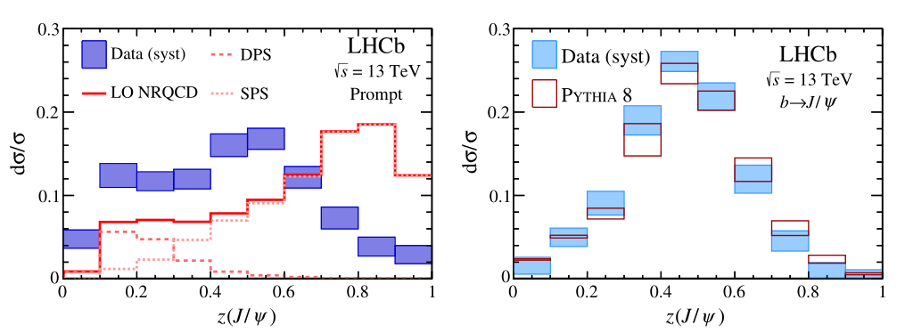
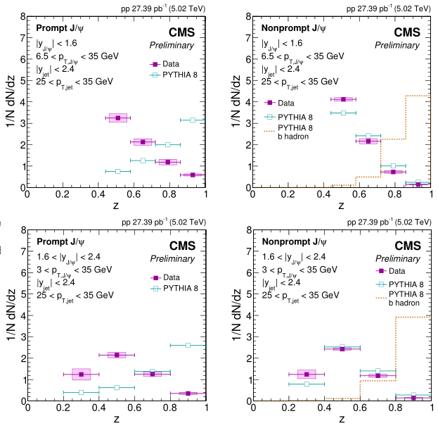

# $J/\psi$ Production in Jets

> From IDEA to PAPER.

Repository for references, analysis codes, useful scripts and related discussions.

Software: [AliPhysics](https://github.com/alisw/AliPhysics)@ROOT6

Main environment: AliEn World-wide Computing Grid

Local: R710.star.ustc.edu.cn `(Dual-E5520 + 16* Dual-E5504)`

Development and post-processing are performed on local environment `(vAN-20190328_ROOT6)`. But for alien, all jobs would run on latest version after debug.

For better display of this document, please install browser extension `MathJax Plugin for Github`  ([Chrome](https://chrome.google.com/webstore/detail/mathjax-plugin-for-github/ioemnmodlmafdkllaclgeombjnmnbima)) or try this [external page](https://ustc.fun/doc/README.html) (temp and not latest). The best solution is to open preview in `VS Code` with [Markdown Preview Enhanced](https://shd101wyy.github.io/markdown-preview-enhanced/).

Author: [Yìtāo WÚ](mailto:yitao.wu@cern.ch)

## Contents

- [Resource](#resource)
- [Background & Motivation](#background--motivation)
  - [Reference](#reference)
- [Physical Object](#physical-object)
  - [Related analysis @ ALICE](#related-analysis--alice)
- [Datasets](#datasets)
  - [Luminosity and event normalization](#luminosity-and-event-normalization)
- [QA](#qa)
  - [Run-wise](#run-wise)
  - [Event](#event)
  - [Track & TPC-ITS](#track--tpc-its)
  - [Calo Cluster / EMCAL+DCAL+PHOS](#calo-cluster--emcaldcalphos)
  - [PID](#pid)
  - [Dielectron](#dielectron)
  - [Jets](#jets)
- [Signal Extraction](#signal-extraction)
  - [Event selection](#event-selection)
  - [PID for electron](#pid-for-electron)
  - [$J/\psi$ reconstruction](#j\psi-reconstruction)
  - [Nano AODs](#nano-aods)
  - [Jet finder](#jet-finder)
- [Correction](#correction)
  - [TPC post-calibration](#tpc-post-calibration)
  - [EMCal correction and embedding framework](#emcal-correction-and-embedding-framework)
  - [$J/\psi$ acceptance and efficiency](#j\psi-acceptance-and-efficiency)
  - [Unfolding of jet $p_{T}$ resolution](#unfolding-of-jet-p_t-resolution)
- [Systematic uncertainties](#systematic-uncertainties)
- [Preliminary Result](#preliminary-result)
- [Publication](#publication)

## Resource

Software: [AliSW@GitHub](https://github.com/alisw) | [GitLab](http://gitlab.cern.ch/) | [AliDoc](http://alidoc.cern.ch/) | Offline Database ([OADB](https://indico.cern.ch/event/128634/contributions/112886/attachments/86273/123628/11-03-09-OW-OADB.pdf "Offline Analysis Database - /eos/experiment/alice/analysis-data/OADB/"), [OCDB](http://alice-offline.web.cern.ch/Activities/ConditionDB.html "Offline Constant Database - alien:///alice/data/[year]/OCDB/[Detector]/*/Data/Run*.root")) | [ROOT](https://root.cern/) | [HEPforge](https://hepforge.org/) |

Documents: [Twiki](https://twiki.cern.ch/twiki/bin/viewauth/ALICE) | [Public & Analysis Note](https://alice-notes.web.cern.ch) | [ALICE Offline](http://alice-offline.web.cern.ch/) | [ALICE Official](http://alice.cern.ch/) |

* DPG: [Twiki](https://twiki.cern.ch/twiki/bin/view/ALICE/AliceDPG "Data Preparation Group") | [Indico](https://indico.cern.ch/category/7871/ "General, AOT, MC, QA, Calibration & Tracking") | [RunLists](https://twiki.cern.ch/twiki/bin/view/ALICE/AliDPGRunLists "Lists of good runs for Run2 periods") | [EventNorm](https://twiki.cern.ch/twiki/bin/viewauth/ALICE/EventNormalization "V0AND value for luminosity") | [Pileup]( https://twiki.cern.ch/twiki/bin/view/ALICE/AliDPGtoolsPileup "Pileup tools and methods") |

* PID: [Twiki](https://twiki.cern.ch/twiki/bin/view/ALICE/PWGPPParticleIdentification "PWGPP-PID") | [PIDinAnalysis](https://twiki.cern.ch/twiki/bin/viewauth/ALICE/PIDInAnalysis "Analysis with PID response") | [Performance](http://arxiv.org/abs/1402.4476 "Section 7-9") | Bayesian([Indico](https://indico.cern.ch/event/476033/ "A Bayesian approach to particle identification in ALICE"), [arXiv](http://arxiv.org/abs/1602.01392)) | [Tender](https://twiki.cern.ch/twiki/bin/viewauth/ALICE/TenderAndAnalysis "Correct imperfections on analysis level") |

* EMCal & Jet: [Intro.](https://indico.cern.ch/event/555035/contributions/2239719/attachments/1310149/1959997/EMCALframework.pdf "July 2016") | [Doc.](http://alidoc.cern.ch/AliPhysics/master/READMEemcfw.html "Based on Doxygen") | [Trigger](https://twiki.cern.ch/twiki/bin/view/ALICE/EMCalTriggerOffline) | [Correction](https://indico.cern.ch/event/586577/contributions/2363131/attachments/1370126/2177061/EMCalCorrectionFramework_AnalysisTutorial_updated.pdf "Nov. 2016") | [Embedding](https://indico.cern.ch/event/586577/contributions/2363130/attachments/1370183/2296645/rehlers.embedding.analysis.tutorial.nov.2016.v3.pdf "Nov. 2016") |

Service: [AliEn](http://alien.web.cern.ch/) | [AliMonitor](http://alimonitor.cern.ch) | [Glance](https://glance.cern.ch/alice/membership/ "ALICE Member - Insititute, People & Service") | [JIRA](https://alice.its.cern.ch/ "Issue Tracking System") | [Vidyo](http://information-technology.web.cern.ch/services/fe/vidyo "Client login URL: https://vidyoportal.cern.ch") | [CERN Account](https://account.cern.ch/account/) | [CERN Service](https://resources.web.cern.ch/resources/Manage/ListServices.aspx "Resource Portal - list all available services") | [CA](https://ca.cern.ch/ca/ "CERN Certificate Authority - Grid, EduRoam, Code signing") | [CERN Mail](https://mmmservices.web.cern.ch/mmmservices/) | [e-groups](https://e-groups.cern.ch/ "CERN mail lists") | [CERNBox](https://cernbox.cern.ch "The cloud storage solution from CERN") | [SWAN](http://swan.cern.ch/ "Provide virtual environment by cloud storage service - CERNBox") |

Tutorial:

* ALICE-analysis-tutorial: [Website](https://alice-analysis.web.cern.ch/content/tutorials) | [Indico](https://indico.cern.ch/category/5819/ "Some events under category of ALICE Week") | [Intro.](https://alice-doc.github.io/alice-analysis-tutorial/) | [DataFlow](https://indico.cern.ch/event/752367/contributions/3116617/attachments/1704565/2858687/DPG_AnalysisTutorial_20181129.pdf "Starterkit - Nov.  2018") | [LEGO train](https://indico.cern.ch/event/327364/contributions/1713450/attachments/635959/875472/juniorsDay-2.pdf "July 2014") | [NanoAOD](https://indico.cern.ch/event/652886/contributions/2658039/attachments/1500603/2336871/nanoAODs.pdf "July 2017") | [EventInfo](https://indico.cern.ch/event/327364/contributions/1713452/attachments/635962/875477/2014-07-04-kryshen-tutorial.pdf "July 2014") | [Q-vector](https://indico.cern.ch/event/586577/contributions/2363129/attachments/1370104/2077614/flowvectors.pdf "Nov. 2016") | [TrackInfo](https://indico.cern.ch/event/327364/contributions/1713452/attachments/635962/875475/TrackSelectionTutorial.pdf "July 2014") | [PID](https://indico.cern.ch/event/555035/contributions/2236078/attachments/1307393/1959973/ParticleID_in_ALICE_15072016.pdf "July 2016") | [Flow](https://indico.cern.ch/event/327364/contributions/1713456/attachments/635966/875483/flow_package_na.pdf "July 2014") | [EventMixing](https://indico.cern.ch/event/652886/contributions/2666025/attachments/1500563/2337020/eventmixing_aohlson.pdf "July 2017") | [Unfolding](https://indico.cern.ch/event/463952/contributions/1981524/attachments/1206439/1758559/unfolding.pdf "Dec. 2015") | [Errors](https://indico.cern.ch/event/652886/contributions/2666026/attachments/1500620/2336893/20170726_stat_syst_unc.pdf "July 2017") | [MC](jklein.web.cern.ch/jklein/mc/ "Dec. 2015"), [Generator](https://indico.cern.ch/event/327364/contributions/1713449/attachments/635957/875470/GeneratorsTutorials.pdf "July 2014") | [RIVET](https://indico.cern.ch/event/555035/contributions/2236077/attachments/1307618/1959552/intro_rivet.pdf "MC tool - July 2016") | [AnaControl](https://github.com/cbourjau/nittygriddy "ALICE+LHCb - Nov. 2017") | [PlotStyle](https://indico.cern.ch/event/327364/contributions/1713455/attachments/635965/875481/main.pdf "July 2014") | [Visual](https://indico.cern.ch/event/743750/contributions/3072931/attachments/1690231/2719440/MultiDimensionalVisualization_O2meeting22052018.pdf "July 2018") | [QAtools](https://indico.cern.ch/event/743750/contributions/3072931/attachments/1690231/2719650/QAtools_Tutorial.pdf "July 2018") | [Git](https://indico.cern.ch/event/616865/ "Git tips & GitHub usage - Mar. 2017") | [alice-docs](https://indico.cern.ch/event/713442/contributions/2931242/attachments/1619989/2581360/The_new_ALICE_documentation_pages.pdf "With GitHub page - Mar. 2018") | [Doxygen](https://indico.cern.ch/event/586577/contributions/2363128/attachments/1370076/2077505/documentYourCode.pdf "Documents for AliRoot & AliPhysics - Nov. 2016") | [ML](https://indico.cern.ch/event/713442/contributions/2931240/attachments/1622111/2581475/2018-03-23_ML_tutorial.pdf "With SWAN - Mar. 2018") |
* ROOT & C++:
[Primer](https://root.cern/guides/primer) | [Courses](https://root.cern/courses) | [Example](https://root.cern.ch/doc/master/group__Tutorials.html "Tutorials inside ROOT") | [PEP-ROOT6](https://pep-root6.github.io/docs/ "C++11 features, Parallellism, Vectorization, Declarative analysis, Python & debug") | [ROOT5to6](https://alice-doc.github.io/alice-analysis-tutorial/analysis/ROOT5-to-6.html "Inside gitbook of Intro. - Mar. 2018") | [Python](https://indico.cern.ch/event/652886/ "July 2017") | [ModernC++](https://indico.cern.ch/event/752367/contributions/3116613/attachments/1704567/2861784/ModernCPP.pdf "Starterkit - Nov. 2018") | [Pointers](https://indico.cern.ch/event/666222/contributions/2722821/attachments/1552323/2439274/Pointers_SAiola.pdf "ALICE+LHCb - Nov. 2017") | [Profiling](https://indico.cern.ch/event/463952/contributions/1981522/attachments/1206438/1758208/alice15-tools-lecture.pdf "Dec. 2016") |
* Others:
[AliSW tutorial](http://alisw.github.io/) | [AliBuild](http://alisw.github.io/alibuild/) | [PCG](https://friederikebock.gitbooks.io/pcgtutorial/ "Photon Conversion Group - Basic, LEGO, QA, Calibration, Cocktail, Neutral meson and direct photon.") | [Debug@ALICE](https://dberzano.github.io/alice/debug/) | [Starterkit2018](https://indico.cern.ch/event/752367 "ALICE + LHCb + SHiP - bash, python, git, alisw, ROOT & debug") |
* School & Course:
[INFN-ESC](https://agenda.infn.it/event/16941/ "https://agenda.infn.it/conferenceOtherViews.py?view=standard&confId=16941") | [Huada-QCD](https://indico.ihep.ac.cn/event/7841/ "The 7th Huada School on QCD - Jet") | [Geant4-events](http://geant4.web.cern.ch/past-events "Geant4 workshop, course and meeting") | [GSI-Summer](https://theory.gsi.de/stud-pro/ "HGS-HIRe International Summer Student Program at GSI, for Europe or GSI/FAIR partner countries") | [France-China](https://cn.ambafrance.org/-Les-Ecoles-d-ete-France-Excellence- "The France Excellence Summer Schools Program - Physics of the two infinities") | [CERN-Summer](https://careers.cern/summer "Summer Student Programme & Openlab summer Student Programme") | [CERN-Fermi](https://indico.cern.ch/event/795313/overview "Joint CERN-Fermilab Hadron Collider Physics Summer School - at young postdocs and senior PhD students") | [Euro-Inst.](http://www.esi-archamps.eu/Thematic-Schools/Discover-ESIPAP "European School of Instrumentation in Particle & Astroparticle Physics") | [Trigger-DAQ](https://indico.cern.ch/event/739424/ "ISOTDAQ 2019 - International School of Trigger and Data AcQuisition") |

Conference & Meeting: [ALICE Conference](http://alice-conferences.web.cern.ch/) |

* Indico@CERN: [ALICE Week](https://indico.cern.ch/category/6871/) | [PWG](https://indico.cern.ch/category/302/) | [EMCal](https://indico.cern.ch/category/874/) | [ITS](https://indico.cern.ch/category/6759/) | [TPC](https://indico.cern.ch/category/14/) |
* Other Indico: [Indico@IHEP](https://indico.ihep.ac.cn/category/208/) | [Indico@USTC-PNP](http://pnp.ustc.edu.cn/indico) | [Indico@IN2P3](https://indico.in2p3.fr/category/100/) |
* Quark Matter: [QM2019](http://qm2019.ccnu.edu.cn/) | [QM2018](http://qm2018.infn.it/) | [QM2017](http://qm2017.phy.uic.edu/) | [QM2015](http://qm2015.riken.jp/) | [QM2014](https://indico.cern.ch/event/219436/) | [QM2012](https://indico.cern.ch/event/181055/) |
* Hard Probe: [HP2018](https://indico.cern.ch/event/634426/) | [HP2016](http://hp2016.ccnu.edu.cn/) | [HP2015](http://www.physics.mcgill.ca/hp2015/) |
* Strangeness Quark Matter: [SQM2019](https://sqm2019.ba.infn.it/) | [SQM2017](https://indico.cern.ch/event/576735/) |
* LHC Physics: [LHCP2019](http://lhcp2019.buap.mx/) | [LHCP2018](http://lhcp2018.bo.infn.it/) | [LHCP2017](http://lhcp2017.physics.sjtu.edu.cn/) | [LHCP2016](http://lhcp2016.hep.lu.se/) | [LHCP2015](http://hepd.pnpi.spb.ru/lhcp2015/index.php/) | [LHCP2014](https://indico.cern.ch/event/279518/) | [LHCP2013](https://indico.cern.ch/event/210555/) |
* Others: [VCI](https://vci.hephy.at/home/ "Vienna Conference on Instrumentation")

Publication: [InspierHEP](http://inspirehep.net) | [CERN Document Server](http://cds.cern.ch/) | [HEPData](https://www.hepdata.net/) | [Google Scholar](http://scholar.google.com) | [Microsoft Academic](https://academic.microsoft.com/) | [SCImago Journal Rank](https://www.scimagojr.com/journalrank.php?category=3106) |

## Background & Motivation

To understood the $J/\psi$ production mechanism, and explain the lack of observed polarization in high $p_{T}$ range. Previous results from LHCb and CMS are disagree with NRQCD predictions implemented by Pythia8.




### Reference

1. Baumgart, Matthew, et al. "Probing quarkonium production mechanisms with jet substructure." JHEP 1411 (2014) 003 [[INSPIRE](http://inspirehep.net/record/1299682)]
2. LHCb Collaboration, "Study of $J/\psi$ Production in Jets", Phys.Rev.Lett. 118 (2017) no.19, 192001 [[INSPIRE](http://inspirehep.net/record/1509507)]
3. Kang, Zhong-Bo, et al. "$J/\psi$ production and polarization within a jet." Phys.Rev.Lett. 119 (2017) no.3, 032001. [[INSPIRE](http://inspirehep.net/record/1512930/)]
4. Bain, Reggie, et al. "NRQCD Confronts LHCb Data on Quarkonium Production within Jets." Phys.Rev.Lett. 119 (2017) no.3, 032002. [[INSPIRE](http://inspirehep.net/record/1514263/)]
5. CMS Collaboration, "Production of prompt and nonprompt $J/\psi$ mesons in jets in pp collisions at $\sqrt{s}=5.02~TeV$", CMS-PAS-HIN-18-012, [[CDS](http://cds.cern.ch/record/2318344)]
6. Dai, Lin, et al. "Quarkonium Polarization and the Long Distance Matrix Elements Hierarchies using Jet Substructure" Phys.Rev. D96 (2017) no.3, 036020 [[INSPIRE](http://inspirehep.net/record/1613333)]
7. Dai, Lin, et al. "Heavy quark jet fragmentation." JHEP 1809 (2018) 109 [[INSPIRE](http://inspirehep.net/record/1673397)]
8. Dai, Lin. "Applications of QCD Effective Theories to the Physics of Jets and Quarkonium Production." PhD Diss. University of Pittsburgh, 2018. [[PDF](http://d-scholarship.pitt.edu/34888/1/dissertation-lin-dai-rev1.pdf)]
9. Konrad Tywoniuk, "Theory Overview - J/psi production in jets" ALICE Jpsi2ee PAG workshop, April 2019 [[SLIDES](https://indico.cern.ch/event/801169/contributions/3368701/attachments/1824252/2984859/Jpsi2ee_Konrad.pdf)]

## Physical Object

The jet fragmentation function $z(J/\psi)$, which is the $p_{T}$ fraction carried by $J/\psi$ in jets.

In proton-proton collision at $\sqrt{s}=13~TeV$, $J/\psi$ mesons are reconstructed using their dielectron channel in **_central barrel_**. The dielectron events were selected offline with the L0 trigger system, requiring **_one_** leg in EMCal/DCal and exceed the L1 energy threshold. Other analysis cuts deployed for electron identification will be presented in following sections. Prompt and non-prompt $J/\psi$ mesons are seperated by pesudo-proper decay length.

Jets are clustered using the anti-$k_{T}$ algorithm from charged tracks, with R=0.2, which provides by [fastjet](http://fastjet.fr "v3.2.1") package.

### Related analysis @ ALICE

1. [[AN-646](https://alice-notes.web.cern.ch/node/646 "Jpsi with EMCal")] "J/ψ measurements in pp collisions at s√ = 13 TeV using EMCal-triggered events with ALICE at LHC", Cristiane Jahnke (Munich EC, DE), 29 June, 2017
2. [[AN-876](https://alice-notes.web.cern.ch/node/876 "Inclusive Jpsi")] "Inclusive Jpsi production cross-section in pp collisions at 13TeV", Ingrid Mckibben Lofnes (UBergen, NO), 19 March, 2019
3. [[AN-850](https://alice-notes.web.cern.ch/node/850 "Charged jet")] "Multiplicity dependence of charged jet production in pp collisions at 13 TeV", Yongzhen Hou (CCNU, CN), 21 September, 2018
4. [[AN-746](https://alice-notes.web.cern.ch/node/746 "Jpsi-Hadron")] "Inclusive J/psi - hadron correlations at mid-rapidty in MB and high multiplicity pp collisions at sqrt(s) = 13 TeV", Lucas Altenkamper (UBergen, NO), 26 April, 2018

## Datasets

ALICE Run2 pp 13TeV (with EMC), 2016-2018

* From DPG twiki : [DataTaking](https://twiki.cern.ch/twiki/bin/view/ALICE/AliDPGReconstructedDataTakingPeriodspp13TeV "Reconstructed Run-2 data taking periods with pp collisions, √s= 13 TeV") | [Production](https://twiki.cern.ch/twiki/bin/view/ALICE/AODsets "AOD version and run number range") | [RunLists-calo](https://twiki.cern.ch/twiki/bin/view/ALICE/AliDPGRunLists "Lists of good runs for Run2 periods") |
* From MonALISA: [RCT](https://alimonitor.cern.ch/configuration/index.jsp?partition=LHC16l&pass=1&raw_run=&filling_scheme=&filling_config=&fillno=&energy=&intensity_per_bunch=&mu=&interacting_bunches=&noninteracting_bunches_beam_1=&noninteracting_bunches_beam_2=&interaction_trigger=&rate=&beam_empty_trigger=&empty_empty_trigger=&muon_trigger=&high_multiplicity_trigger=&emcal_trigger=&calibration_trigger=&quality=&muon_quality=&physics_selection_status=&comment=&field=&det_aco=&det_ad0=&det_emc=1&det_fmd=&det_hlt=&det_hmp=&det_mch=&det_mtr=&det_phs=&det_pmd=&det_spd=1&det_sdd=1&det_ssd=1&det_tof=&det_tpc=1&det_trd=&det_t00=&det_v00=1&det_zdc=&hlt_mode=&changedon= "Run condition table on alimonitor") (DET Status Flags - SPD + SDD + SSD + TPC + V0 + EMCal)|
* From LEGO train : [DQ_pp_AOD](https://alimonitor.cern.ch/trains/train.jsp?train_id=29) | [Jet_EMC_pp](https://alimonitor.cern.ch/trains/train.jsp?train_id=47) |

All datasets used is collected in **Datasets/DQ_pp_AOD.C**, which can be executed and accessed like *DATASETS["16l_pass1"]*. If not in LEGO train, the number of jobs will be **_limited under 1500, about 33 runs._** Original run lists from DPG is stored under **Datasets/DATA/**.

Run Period|MB|Muon|EMCAL|N runs|INT7|EMCEGA|EG1|EG2|DG1|DG2|Nano|
-|-|-|-|-|-|-|-|-|-|-|-|
18p|64,723,976|38,946,331|8,206,052|66
18o|27,495,955|14,997,718|3,506,262|26
18n*|3,835,344|21,207||2
18m|134,624,309|60,378,259|15,669,592|142
18l|40,366,370|16,800,730|4,118,681|39
18k|8,764,716|36,793,499|906,769|10
18j|96,797|43,361|9,597|1
18i*|55,845,385|553,722||7
18h|4,251,665|1,834,724|434,065|2
18g*|1,508,180|||1
18f|44,009,568|18,923,929|4,653,741|46
18e|52,440,125|21,328,980|6,170,463|38
18d|28,079,632|11,969,409|3,317,779|28
18c*|267,232,152|14,312,085||46
18b*|167,363,075|2,107,216||22
17r|25,356,149|16,306,258|4,554,303|27
17o|101,301,254|61,352,135|17,350,119|128
17m*|97,253,493|15,004,475|4,932,360|93
17l|66,971,443|41,517,736|11,726,035|105
17k|89,488,618|38,583,640|11,652,619|93
17j*|41,314,510|163,093||10
17i*|54,162,665|14,422,733|4,209,950|56
17h*|90,126,837|16,633,082|5,610,223|63
17g*|110,598,542|1,620,926||26
17f*|12,112,114|106,809|3,583|5
17c*|1,962,343|601||4
16p|23,175,087|13,077,528|2,570,124|39
16o*|9,397,646|3,195,337|740,813|17
16l|30,687,176|17,153,082|18,057,636|51
16k|105,446,176|47,974,758|17,241,173|123
16j|53,638,211|14,260,378|3,581,261|33
16i|36,566,073|12,227,075|2,272,121|14
16h*|50,404,063|11,696,888||35
16g*|19,103,014|2,450,982||8
Total|1,619,516,002|438,267,301|124,113,415|1,127

### Luminosity and event normalization

Luminosity is used to normalize the measured spectra for cross section estimation.

$$\frac{d^{2}\sigma}{dp_{T}d\eta}=\frac{1}{\mathscr{L}_{int}}\frac{N_{phys.obj.}}{\Delta p_{T}\Delta \eta}$$

The determinination of the integrated luminosity is based on the measurement of a reference cross section, $\sigma_{V0AND}$, obtained from a van-der-Meer scan. From [result](https://cds.cern.ch/record/2160174 "ALICE-PUBLIC-2016-002, Jun. 10th 2016") in 2015: $\sigma_{V0AND}=57.8~mb\pm5\%~(sys.)$, while $\mathscr{L}=N_{V0AND}^{corr.}/\sigma_{V0AND}$.

The number of events $N_{V0AND}^{corr.}$ includes events with and without a reconstructed vertex within the vertex requirement $|z|<10~cm$. We assume the events without a reconstructed vertex follow the same vertex distribution as reconstructed events, so the event number can be estimated from the fraction $f_{z}$ (with Gaussian function).

$$N_{corr.}=f_{z}\cdot N_{sel.}=\frac{N_{|VtxZ|<10cm}}{N_{Vtx}}\cdot N_{sel.}$$

## QA

To check the status and performance of detectors and the agreement between data and MC. Level: Run, Event, Track, Detector, PID, Phys. Objects

* From DPG and PWG/PAG tutorial.
* From related analysis note.

### Run-wise

Run-wise QA is generated from histograms of event, track, cluster and other levels run-by-run. Average value of variables and event counts are frequently used indexes. If possible, use `THnSparse` to store variables for the convenience of post plotting.

Parameter|Description|Method|
-|-|-|
$N_{events}$|Number and fraction of events in triggers and event cuts.||
$\bar{N}_{Good~tracks}$|Average number of good tracks||
$\bar{N}_{SPDtracklets}$|Average number of SPD tracklets||
$\bar{Z}_{Vtx}, \sigma(Z)_{Vtx}$|Mean and sigma value of vertex Z or (X/Y/XY)||
$\bar{N}_{contributors}^{Vtx}$|Average number of vertex contributors||
$<Multiplicity>$|Average value of multiplicity, includes VZERO amp.||
$<Q_{n}>$|Average value of event plane Q value||
$\bar{N}_{clusters}$|Average number of calo clusters||
$Cluster~\eta$-$\phi~map$|Identify bad cells/RCU||
$BadCell_{ID}$|Dead or Hot/Warm cells||
$<VAR_{tracks}>$|Average value or distribution of selected tracks after selection, basic and PID variables||

### Event

Trigger and event cut overview histograms, like  MB, Pileup, good, $Z_{Vtx}<~10cm, \eta<0.9$, ratio of different trigger or cut definition.

__Statistics of event selection (vs triggers, and in run-wise)__: Physics Selection (PS), trigger, event cuts, track cuts (no tracks), filtered in nano AOD (with candidates of physics objects) and corresponding reject reasons.

Event ID = $N_{bunch-crossing}+N_{orbit}\times3564+N_{period}\times\rm{0xFFFFFF}\times3564$

For offline trigger,use `AliAnalysisTaskMultiDielectron::SetTriggerMask` instead of `AliAnalysisTaskSE::SelectCollisionCandidates`, if event cuts/filter existed. And trigger class is selected by `AliAnalysisTaskMultiDielectron::SetFiredTriggerName`. (__PWGDQ/dielectron__ ONLY)

<details>
<summary>ALICE Offline Triggers</summary>

> from [AliVEvent.h](https://github.com/alisw/AliRoot/blob/master/STEER/STEERBase/AliVEvent.h))

EOfflineTriggerTypes |BIT(N)|Description|
-|-|-|
kMB| 0|Minimum bias trigger in PbPb 2010-11
kINT1| 0|V0A \| V0C \| SPD minimum bias trigger
__kINT7__| 1|V0AND minimum bias trigger __(MB for pp)__
kMUON| 2|Single muon trigger in pp2010-11, INT1 suite
kHighMult| 3|High-multiplicity SPD trigger
kHighMultSPD| 3|High-multiplicity SPD trigger
kEMC1| 4|EMCAL trigger in pp2011, INT1 suite
kCINT5| 5|V0OR minimum bias trigger
kINT5| 5|V0OR minimum bias trigger
kCMUS5| 6|Single muon trigger, INT5 suite
kMUSPB| 6|Single muon trigger in PbPb 2011
kINT7inMUON| 6|INT7 in MUON or MUFAST cluster
kMuonSingleHighPt7| 7|Single muon high-pt, INT7 suite
kMUSH7| 7|Single muon high-pt, INT7 suite
kMUSHPB| 7|Single muon high-pt in PbPb 2011
kMuonLikeLowPt7| 8|Like-sign dimuon low-pt, INT7 suite
kMUL7| 8|Like-sign dimuon low-pt, INT7 suite
kMuonLikePB| 8|Like-sign dimuon low-pt in PbPb 2011
kMuonUnlikeLowPt7| 9|Unlike-sign dimuon low-pt, INT7 suite
kMUU7| 9|Unlike-sign dimuon low-pt, INT7 suite
kMuonUnlikePB| 9|Unlike-sign dimuon low-pt in PbPb 2011
__kEMC7__|10|__EMCAL/DCAL L0 trigger__, INT7 suite
kEMC8|10|EMCAL/DCAL L0 trigger, INT8 suite
kMUS7|11|Single muon low-pt, INT7 suite
kMuonSingleLowPt7|11|Single muon low-pt, INT7 suite
kPHI1|12|PHOS L0 trigger in pp2011, INT1 suite
kPHI7|13|PHOS trigger, INT7 suite
kPHI8|13|PHOS trigger, INT8 suite
kPHOSPb|13|PHOS trigger in PbPb 2011
__kEMCEJE__|14|EMCAL/DCAL L1 jet trigger
__kEMCEGA__|15|EMCAL/DCAL L1 gamma trigger, including high and low trigger classes
kHighMultV0|16|High-multiplicity V0 trigger
kCentral|16|Central trigger in PbPb 2011
kSemiCentral|17|Semicentral trigger in PbPb 2011
kDG|18|Double gap diffractive
kDG5|18|Double gap diffractive
kZED|19|ZDC electromagnetic dissociation
kSPI7|20|Power interaction trigger
kSPI|20|Power interaction trigger
kINT8|21|0TVX trigger
kMuonSingleLowPt8|22|Single muon low-pt, INT8 suite
kMuonSingleHighPt8|23|Single muon high-pt, INT8 suite
kMuonLikeLowPt8|24|Like-sign dimuon low-pt, INT8 suite
kMuonUnlikeLowPt8|25|Unlike-sign dimuon low-pt, INT8 suite
kMuonUnlikeLowPt0|26|Unlike-sign dimuon low-pt, no additional L0 requirement
kUserDefined|27|Set when custom trigger classes are set in AliPhysicsSelection
kTRD|28|TRD trigger
kMuonCalo|29|Muon-calo triggers
kCaloOnly|29|MB, EMCAL and PHOS triggers in CALO or CALOFAST cluster
|||__Bits 30 and above are reserved for FLAGS__
kFastOnly|30|The fast cluster fired. This bit is set in to addition another trigger bit, e.g. kMB
kAny|0xffffffff|to accept any defined trigger
kAnyINT||kMB \| kINT7 \| kINT5 \| kINT8 \| kSPI7. to accept any interaction (aka minimum bias) trigger
</details>

<details>
<summary>ALICE Trigger Classes</summary>

> from [ALICE Trigger Coordination](https://twiki.cern.ch/twiki/bin/viewauth/ALICE/TriggerCoordination) and [CTP](alicetrigger.web.cern.ch/alicetrigger/)

__Trigger Class = Trigger Condition + Trigger Cluster + Trigger Vetoes__
Typical trigger class name:
  CEMC7EGA-B-NOPF-CENTNOTRD
  [Decriptor]-[BC_mask]-[PF_protection]-[Cluster].

* Descriptor: combination of trigger inputs, L0+L1 (AND, OR, VETO logic is possible).
* BC mask: information about interactions (__beam-beam__, beam-gas, satellite, etc.).
* Past-Future protection: rejects events with multiple collisions from __different bunch crossings__
* Cluster: group of detectors to be readout if the trigger conditions is satisfied (ALLNOTRD, CENTNOTRD, ALL, CENT, FAST, MUON)

</details>

<details>
<summary>AOD tree structure</summary>

> from [AliAODEvent.h](https://github.com/alisw/AliRoot/blob/master/STEER/AOD/AliAODEvent.h)

__AOD__ (Analysis Object Data) is skimmed data for higher-level analysis, conveted from ESD by [AliAnalysisTaskESDfilter](https://github.com/alisw/AliRoot/blob/master/ANALYSIS/ESDfilter/AliAnalysisTaskESDfilter.h).


AODListIndex_t|Name|Description
-|-|-|
kAODHeader|__header__|Event meta information, such as run number, magnetic field, diamond, trigger, etc.
kAODTracks|__tracks__|Charged tracks array
kAODVertices|__vertices__|Vertex array
kAODv0|v0s|
kAODcascade|cascades|
kAODTracklets|tracklets|SPD tracklets
kAODJets|jets
kAODEmcalCells|emcalCells
kAODPhosCells|phosCells
kAODCaloClusters|__caloClusters__|EMCal, DCal, PHOS clusters array|
kAODEMCALTrigger|emcalTrigger
kAODPHOSTrigger|phosTrigger
kAODFmdClusters|fmdClusters
kAODPmdClusters|pmdClusters
kAODHMPIDrings|hmpidRings
kAODDimuons|dimuons
kAODTZERO|AliAODTZERO
kAODVZERO|AliAODVZERO
kAODZDC|AliAODZDC
kAODAD|AliAODAD
kTOFHeader|AliTOFHeader|Event time estimated by TOF
kAODTrdTracks|trdTracks
-|Forward|
-|ForwardEP|
-|CentralClusters|
-|MultSelection|
-|UserInfo|
</details>

Variables on event level:

* Vertex: Z distribution and XY.
* Multiplicity, centrality and event plane.
* N candidates, $J/\psi, jets, \eta, gamma, \pi_0$, ...
* Clusters: Numbers, Energy distribution, etc.

Parameter|Description|Std. Method|Typical value|Setup|
-|-|-|-|-|
$Z_{Vtx}$|Z postion (cm) of primary vertex|aod->GetPrimaryVertex()->GetZ()|$0.6\pm4.1$|[-50,50] / 0.1|
||X position (cm)|aod->GetPrimaryVertex()->GetX()|$0.074\pm0.006$|[-0.5,0.5] / 0.001|
||Y position (cm)|aod->GetPrimaryVertex()->GetY()|$0.367\pm0.004$|[-0.5,0.5] / 0.001|
Diamond|Z position and width of the __interaction point (IP)__ (cm)|header->GetDiamondX()/GetSigma2DiamondX()|$0.809\pm\sqrt{24.6}$|-|
||X position and width of the __interaction point (IP)__ (cm)|header->GetDiamondX()/GetSigma2DiamondX()|$0.080\pm\sqrt{6.0e-5}$|-|
||Y position and width of the __interaction point (IP)__ (cm)|header->GetDiamondX()/GetSigma2DiamondX()|$0.368\pm\sqrt{2.84e-5}$|-|
$N_{contributors}^{Vtx}$|Number of primary vertex contributors||$\bar{N}\sim25$|[0,500] / 1|
$N_{tracklets}$|Number of SPD tracklets (__aod->GetMultiplicity()__), by layers|spd->GetNumberOfTracklets()|$\bar{N}\sim28$|[0,200] / 1|
$Z_{Vtx}$-$N_{tracklets}$|Correction needed for multiplicity analysis||
$N_{ITSclusters}$|Number of ITS clusters, by layers.|spd->GetNumberOfITSClusters(lr)|$\bar{N}\sim540$|[0,20000] / 1|
||SPD (pixel), layer 0 and 1||$\bar{N}\sim110$|[0,10000] / 1|
||SDD (drift), layer 2 and 3||$\bar{N}\sim70$|[0,3000] / 1|
||SSD (strip), layer 4 and 5||$\bar{N}\sim80$|[0,2000] / 1|
$N_{SPDfiredChips}$|Number of SPD fired chips __(1200 in total)__, by layers.|spd->GetNumberOfFiredChips(lr)|$\bar{N}\sim115$|[0,1200] / 1|
$N_{tracks}$|Number of tracks w/ or w/o track cuts|aod->GetNumberOfTracks()|$\bar{N}_{total}\sim640$|[0,4000] / 1|
$A_{VZERO}$|Amplitute of VZERO multiplicity decision as sum of 64 ch. (__aod->GetVZEROData()__)|vzero->GetMultiplicity(ch)|$\bar{A}\sim95$|[0,2000] / 1|
||V0A, channel 32 - 63|vzero->GetMultiplicityV0A(ch)|$\bar{A}\sim37$|[0,2000] / 1|
||V0C, channel 0 - 31|vzero->GetMultiplicityV0A(ch)|$\bar{A}\sim58$|[0,2000] / 1|
Centrality|Estimtor by multiplicity percentiles or impact factor|[AddTaskMultSelection.C](https://github.com/alisw/AliPhysics/blob/master/OADB/COMMON/MULTIPLICITY/macros/AddTaskMultSelection.C)|
Q-vector|Event plane framework|[AddTaskFlowQnVectorCorrections.C](https://github.com/alisw/AliPhysics/blob/master/PWGPP/EVCHAR/FlowVectorCorrections/QnCorrectionsInterface/macros/AddTaskFlowQnVectorCorrections.C)|
$N_{cluster}$|Number of calo clusters|aod->GetNumberOfCaloClusters()|$\bar{N}\sim37$|[0,500] / 1|
$E_{cluster}$|Energy distribution of calo clusters (GeV)|calo->E()|$\bar{E}\sim0.5$|[0,300] / 0.1|

*__spd__ is the instance of SPD tracklets `AliAODTracklets` from `AliAODEvent::GetMultiplicity()`.
*Typical values and histogram setup are referred to [AN746] and fully AOD tree.

### Track & TPC-ITS

Track selection and tracking parameters. The getter methods depend on the variable manager in PWG analysis framework, while methods listed blow are standard function from basic class in AliRoot/STEER.

<details>
<summary>Track types / status flag</summary>

> from [AliVTrack.h](https://github.com/alisw/AliRoot/blob/master/STEER/STEERBase/AliVTrack.h "8feaf83 on 28 Jun 2018")

Enum|BIT(N)|Description|
-|-|-|
|kITSin|0|
|kITSout|1|
|kITSrefit|2|
|kITSpid|3|
|kTPCin|4|
|kTPCout|5|
|kTPCrefit|6|
|kTPCpid|7|
|kTRDin|8|
|kTRDout|9|
|kTRDrefit|10|
|kTRDpid|11|
|kTOFin|12|
|kTOFout|13|
|kTOFrefit|14|
|kTOFpid|15|
|kHMPIDout|16|
|kHMPIDpid|17|
|kEMCALmatch|18|
|kTRDbackup|19|
|kTOFmismatch|20|
|kPHOSmatch|21|
|kITSupg|22|flag that in the ITSupgrade reco
|kSkipFriend|23|flag to skip friend storage
|kGlobalMerge|24|
|kMultInV0|25|assumed to be belong to V0 in multiplicity estimates
|kMultSec|26|assumed to be secondary (due to the DCA) in multiplicity estimates|
|kEmbedded|27|Is a track that has been embedded into the event
|kITSpureSA|28|
|kTRDStop|29|
|kESDpid|30|
|kTIME|31|
__Others__|-|
kTRDnPlanes|6|Not in BIT|
kEMCALNoMatch|-4096|
kTOFBCNA|-100|
</details>

<details>
<summary>Track bits / pre-defined filter</summary>

> from [AliAODTrack.h](https://github.com/alisw/AliRoot/blob/master/STEER/AOD/AliAODTrack.h "27fc1a9 on 11 Apr 2019"), and the details is located in [AliAnalysisTaskESDfilter](https://github.com/alisw/AliRoot/blob/master/ANALYSIS/ESDfilter/AliAnalysisTaskESDfilter.cxx "Convert ESD to AOD") and [AliESDtrackCuts](https://github.com/alisw/AliRoot/blob/master/ANALYSIS/ANALYSISalice/AliESDtrackCuts.cxx "Pre-defined ESD track cuts"). As usual, the track cuts contains __TPC cluster number, $\chi^{2}$, DCA, refit requirements and kink rejection__:

AODTrkFilterBits_t|BIT(N)|Description|Detail|
-|-|-|-|
kTrkTPCOnly|0|Standard TPC only tracks|GetStandardTPCOnlyTrackCuts|
|kTrkITSsa|1|ITS standalone, require ITS standalone tracks (remove pure SA)|?SetRequireITSStandAlone(kTRUE)?|
|kTrkITSConstrained|2|Pixel OR necessary for the electrons AND standard track cuts|SetClusterRequirementITS(kSPD, kAny)|
|kTrkElectronsPID|3|PID for the electrons|SetTPCnSigmaCut(AliPID::kElectron, 3.5)|
|kTrkGlobalNoDCA|4|standard cuts with very loose DCA (\|xy\|>2.4, \|z\|<3.2, 2D=kTRUE)|GetStandardITSTPCTrackCuts2011(kFALSE)|
|kTrkGlobal|5|standard cuts with tight DCA cut, (\|xy\|<"0.0105+0.0350/pt^1.1", \|z\|<2)|GetStandardITSTPCTrackCuts2011(kTRUE)|
|kTrkGlobalSDD|6|standard cuts with tight DCA but with requiring __the first SDD cluster__ instead of an SPD cluster tracks selected by this cut are exclusive to those selected by the previous cut|GetStandardITSTPCTrackCuts2011(kTRUE), GetClusterRequirementITS(kSPD,kNone), GetClusterRequirementITS(kSDD,kFirst)|
|kTrkTPCOnlyConstrained|7|__Refitted__ TPC only tracks: TPConly information constrained to SPD vertex in the filter below|GetStandardTPCOnlyTrackCuts, esdFilter->SetTPCOnlyFilterMask(128)|
__AODTrkBits_t__||
|kIsDCA|14|set if fPosition is the DCA and not the position of the first point
|kUsedForVtxFit|15|set if this track was used to fit the vertex it is attached to
|kUsedForPrimVtxFit|16|set if this track was used to fit the primary vertex
|kIsTPCConstrained|17|set if this track is a SA TPC track constrained to the SPD vertex, needs to be skipped in any track loop to avoid double counting
|kIsHybridTPCCG|18|set if this track can be used as a hybrid track i.e. Gbobal tracks with certain slecetion plus the TPC constrained tracks that did not pass the selection
|kIsGlobalConstrained|19|set if this track is a global track constrained to the vertex, needs to be skipped in any track loop to avoid double counting
|kIsHybridGCG|20|set if this track can be used as a hybrid track i.e. tracks with certain selection plus the global constraint tracks that did not pass the selection
</details>

Parameter|Description|Std. Method|Typical Value|Setup|
-|-|-|-|-|
$p/p_{T}$-$\eta$-$\phi$|Basic kinematic variables||
||$p_{T}$, transverse momentum (GeV/c)|trk->Pt()|$\bar{p_{T}}\sim0.66$|[0,50] / 0.05|
|$\eta$-$\phi$ map|$\eta$, pesudo-rapidity; $\phi$, plane angle|trk->Eta()/Phi()|$\bar{\eta}\sim0.5$, $\bar{\phi}\sim0.0$|[-1.0,1.0] / 0.002, [0,$2\pi$] / 0.006|
DCA|Distance of the closest approach, also known as impact parameter.||
||Large $DCA_{xy}$ is related to the subsequent decays or photon conversions. (cm)|trk->DCA()|$0.00\pm0.19$|[-50,50] / 1000|
||$DCA_z$ can be used for rejection of out-of-bunch pileup tracks.|trk->ZAtDCA()|$0.00\pm0.15$|[-50,50] / 1000|
$N_{cls.}^{TPC}$|TPC cluster number, __160 (max.)__|trk->GetTPCncls()|$\bar{N}\sim100$|[0,161] / 1|
$N_{clsF}^{TPC}$|TPC __findable__ cluster number|trk->GetTPCnclsF()|$\bar{N}\sim105$|[0,161] / 1|
$N_{clsS}^{TPC}$|TPC __shared__ cluster number|trk->GetTPCnclsS()|$\bar{N}\sim24$|[0,161] / 1|
$N_{x.rows}^{TPC}$|Crossed rows in TPC.|trk->GetTPCNCrossedRows()|$\bar{N}\sim109$|[0,161] / 1|
$N_{cls.}^{ITS}$|ITS cluster number, sum by layers [0,6]|trk->GetITSNcls()|$\bar{N}\sim5$|[0,7] / 1|
$\chi^{2}/N_{clusters}^{TPC}$|TPC cluster tracking/fitting, $\chi^{TPC}_{TPC}=fChi2perNDF\times(N_{cls.}^{TPC}-5)$|trk->GetTPCchi2()/trk->GetTPCncls()|$\bar{\chi^{2}}\sim1.2$|[0,100] / 0.1|
$\chi^{2}_{ITS}$|ITS cluster tracking/fitting|trk->GetITSchi2()|$\bar{\chi^{2}}\sim1.7$|[0,100] / 0.1|
Kink|Tracks which does not have a continous particle trajectories, but show deviations due to __decays or the emission of Bremsstrahlung__.||
Refit|Fitting method, include ITS and TPC||

For electron, the particle can hit the first or the second layer of the ITS detector (kAny). This cut helps to remove electrons from __gamma conversion__.

### Calo Cluster / EMCAL+DCAL+PHOS

The cluster QA covers general cluster and cell properties. [Official QA Repository](http://aliqaemc.web.cern.ch/aliqaemc/data/), reference task - AliAnalysisTaskClusterQA / AddTask_ClusterQA from Gamma Conversion Group. Be careful with the binning of cluster energy histograms. All histogram can be updated after triggger selection and QA or analysis cuts (pt range, track charge, etc.).

Parameter|Description|Method|
-|-|-|
$N_{fired}$|Number of cells fired||
$E_{cell}$|Energy vs Cell ID||
$Time_{cell}$|Timing vs Cell ID||
$N_{cluster}$|Number and averge of clusters||
$\eta$-$\phi$|Geomtry map of cluster||
$D_{cluster}$|Distance of cluster to others withing the same time window - cluster overlap||
$E_{cluster}$|Cluster energy||
M02, M20, dispersion|Shower shape parameters||
NLM|Number of local maxia, vs Ncells/E||
$\Delta\eta$-$\Delta\phi$|Cluster track matching||
$D_{trk-cls}$|Distance of track to cluster, vs $\Delta\eta$-$\Delta\phi$||
$p_{T}$|Pt dependent matching variable, vs $\Delta\eta$-$\Delta\phi$||

To identify bad, dead and warm/hot cells, calibrate energy and timing, caculate EFrac and compare with mean value of neighboring cells.

> EFrac (Unit: %) = cells energy fraction of full cluster energy, summed over all events --> turned out to be a much better discriminator than just looking how often cells fired

Definition|EFrac|Range of EFrac or mean|
-|-|-|
Dead cell|EFrac < mean/3|mean>80|
-|EFrac < mean/5|40 < mean < 80|
-|EFrac < mean/8|10 < mean < 40|
-|EFrac < mean/10|mean < 10|
Warm/Hot cell|EFrac > 80|EFrac > 2 *mean|
-|EFrac > 20|EFrac > 3 *mean|
-|EFrac > 8|EFrac > 4 *mean|
-|EFrac > 5|EFrac > 5 *mean|

ADC/Energy Trigger Threshold: [Twiki](https://twiki.cern.ch/twiki/bin/view/ALICE/EMCalTriggerOffline "EMCalTriggerOffline"), this value can also be estimated with peaks in cluster energy distribution due to the pre-scale. Considering the energy resolution, energy cuts using for analysis MUST be, about 1 GeV, higher than the configured thresholds.

Period | L0 ADC | $E_{th}$/GeV | L1-EG1/DG1 |$E_{th}$/GeV| L1-EG2/DG2|$E_{th}$/GeV|
-|-|-|-|-|-|-|
16i-k|132|2.5|115|9|51|4|
16l?|132|2.5|78|6|51|4|
16o-p|132|2.5|115|9|51|4|
*17g-r|-|-|-|~11|-|~5|

*From peak value in cluster energy distribution.

### PID

Particle identification is performed on track level with detector response for final particles, like electron, muon, pion, kaon and proton (deuton, triton, helium-3, helium-4 for special topics). Traditionally, we deploy rectangular cuts on detector response ($n\sigma_{e/\pi/K/p/\mu}$) to seperate particles. Bayesian approch, TMVA and other machine learning methods have also been studied and developed.

Definition of detector response:

$$\xi=n\sigma=\frac{x_{PID}(signal)-\hat{x}_{PID}(m/z)}{\sigma(Detector Resolution)}$$

Detector response/signal:

* ITS & TPC - dE/dx : Energy loss based on Bethe-Bloch curve.
* EMCal - E/p : Ratio of total energy and momentum.
* TOF - $1/\beta$ : Time of flight.
* TRD - Q : Energy loss and production of transition radiation.
* HMPID - $\beta$ : Cenrenkov angle.

PID framework:

* AliPIDResponse: Common way with $n\sigma$ cuts.
* AliPIDCombined: To manage combination of detector response using a Bayesian approach.

Basic usage: Load macro [**AddTaskPIDResponse.C**](https://github.com/alisw/AliRoot/blob/master/ANALYSIS/macros/AddTaskPIDResponse.C). Example can be found in [AliAnalysisTaskPIDqa.cxx](https://github.com/alisw/AliRoot/blob/master/ANALYSIS/ANALYSISalice/AliAnalysisTaskPIDqa.cxx).

```C++
  //input hander
  AliAnalysisManager *man=AliAnalysisManager::GetAnalysisManager();
  AliInputEventHandler *inputHandler=dynamic_cast<AliInputEventHandler*>(man->GetInputEventHandler());
  //pid response object
  fPIDResponse=inputHandler->GetPIDResponse();
  // detector response
  double kaonSignal = fPIDResponse->NumberOfSigmasTPC(track, AliPID::kKaon);
  double pionSignal = fPIDResponse->NumberOfSigmasTPC(track, AliPID::kPion);
  double protonSignal = fPIDResponse->NumberOfSigmasTPC(track, AliPID::kProton);
```

Bayesian approach: **AliPIDCombined**

```C++
// SETTING methods - UserCreateOutputObjects
// specify the detectors you want (OR syntax)
void SetDetectorMask(Int_t mask);
// specify lists of species (default: AliPID::kSPECIES=5)
void SetSelectedSpecies(Int_t selectedSpecies);
// load default TPC priors
void SetDefaultTPCPriors();
// load your own priors as a function of pt
void SetPriorDistribution(AliPID::EParticleType type,TH1F *prior);

// EXEC method - UserExec
// compute probabilities, return mask of detectors used and prob. array in bayesProbabilities
UInt_t ComputeProbabilities(const AliVTrack *track, const AliPIDResponse *response, Double_t* bayesProbabilities,Double_t* priorsOwn=NULL) const;
// Retrieve the probability to have a TPC-TOF mismatch
static Float_t GetTOFmismatchProb();

// OTHER
// Retrieve the priors used for a given track and a given detector mask
void GetPriors(const AliVTrack *track,Double_t* priors,Float_t centrality=-1,Bool_t isPPB=kFALSE) const;
// Return TPC priors histo for a given species
TH1* GetPriorDistribution(AliPID::EParticleType type)  const;

```

PID tender **_only for ESD_**: [AddTaskTender.C](https://github.com/alisw/AliPhysics/blob/master/TENDER/TenderSupplies/AddTaskTender.C)

```C++
// all paramerters are boolean variables
AddTaskTender(kV0, kTPC, kTOF, kTRD, kPID, kVTX, kT0, kEMCal, kPtFix);
```

QA Task for general purpose: [AddTaskPIDqa.C](https://github.com/alisw/AliRoot/blob/master/ANALYSIS/macros/AddTaskPIDqa.C)

Signal or $n\sigma$ vs $p/p_{T}/\eta/\phi$

Hybrid signal: TPC-TOF, TPC-EMCal, TRD-?

### Dielectron

Standard setup for invariant mass spectrum: $[1.5, 5.0]~/~0.04~(GeV/c^{2})$, pre-defined $J/\psi$ range: $[2.92, 3.16]~(GeV/c^2)$

Parameter|Description|Method|
-|-|-|
$m_{e^{+}e^{-}}$|Invariant mass of selected dielectron||
$p_{T}$-$\eta$-$\phi$|Basic kinematic variables||
$m_{e^{+}e^{-}}$ vs $p_{T}$|Dielectron momentum spectrum||
$\ell_{J/\psi}$|Pseudoproper-decay-length (cm)||
$N_{candidates}$|Event level, number of dielectron after cuts||
$N_{J/\psi}/<N_{J/psi}>$ vs $N_{trackles}/<N_{tracklets}>$|Event level, ratio of candidates and multiplicity||

### Jets

In ALICE offline software, jets are reconstructed with external package - fastjet. The input parameters contain clustering algorithm (anti-kT), jet cone raidus (R=0.2 for pp), recombination scheme ($p_{T}$-scheme) and ghost area units (0.01) with selected tracks ($p_{T}>0.15~GeV/c$) for $|\eta_{jet}|<0.9-R$. The density of jet is defined as $\rho=median\{p_{T,i}/A_{i}\}$, and $p_{T}$ corrected after subtraction of UE (underlying-event) is: [AN-850:2.6]

$$p_{T,jet}^{corr.}=p_{T,jet}-\rho\cdot Area_{jet}$$

Parameter|Description|Method|
-|-|-|
$p_{T}$-$\eta$-$\phi$|Jet basic kinematic variables||
Area|Jet area||
$p_T$ vs A|Use cut of 0.6*R to reduce fake jet contamination||
$\rho$|Jet UE density, Event level||
$\rho$ or <$\rho$> vs $p_{T,jet}^{leading}$|Jet UE density vs $p_{T}$ of leading hadron, Event level||
$\rho$ or <$\rho$> vs $N_{tracks}$|Jet UE density vs multiplicity, Event level||
$\delta p_{T}$ vs prob. density|Density fluctuation, $\delta p_{T}=\sum_{RC}^{i}p_{T,i}^{track}-\rho\cdot A_{RC}$||

RC is random cone method for the fluctuation of jet UE density.

## Signal Extraction

In PWGDQ, there are two analysis frameworks, __dielectron__ and __reducedTree__, for general purpose of dielectron and quarkonium physics.

The core class of __dielectron__ is `AliDielectron`, which consists of event processing methods, analysis cuts/filters (event, track, leg and pair), arrays of tracks and pair candidates, histogram manager, correction framework manager, event mixing handler, track rotator and MC signal. Physics variables are processed and stored in `AliDielectronVarManager`.

```C++
// To load dielectron framework
#include "AliDielectron.h"
#include "AliDielectronVarManager.h"
#include "AliDielectronVarCuts.h"
#include "AliDielectronEventCuts.h"
#include "AliDielectronPairLegCuts.h"
#include "AliDielectronTrackCuts.h"
#include "AliDielectronCF.h"

class AliDielectron;
class AliDielectronVarManager;
class AliDielectronVarCuts;
class AliDielectronEventCuts;
class AliDielectronPairLegCuts;
class AliDielectronTrackCuts;
class AliDielectronCF;
```

The __reducedTree__ was created as restructuring of dielectron package in [Oct 2015](https://github.com/alisw/AliPhysics/commit/8ccb5a33630bc3218175dd2eb19b7c1f62f6050e). With `AliAnalysisTaskReducedTreeMaker`, original AOD tree woud be filtered and converted to dst tree.

### Event selection

The events are required to pass the physics selection ([Task](https://github.com/alisw/AliPhysics/blob/master/OADB/macros/AddTaskPhysicsSelection.C)) and have a reconstructed vertex. For $J/\psi$ analysis in high $p_{T}$ range, we select EMCal triggered electron (single) for dielectron reconstruction and use MB events to determine the rejection factor (RF) of EMCal.

Variable | Cut / Value|
|-|-|
Offline Trigger|MB/kINT7
-|EMCal L1/kEMCEGA (EG1/EG2/DG1/DG2)|
Vertex type|GetPrimaryVertex()|
$N_{contrib.}^{Vtx}$|>1|
\|$Z_{Vtx}$\||< 10 cm|
Physics Selection|True|
Pileup|False|

Primary vertex can be reconstructed from tracks, TPC, SPD, and GetPrimaryVertex() returns the best available.

There are two types of pileup that have to be considered:

* *in-bunch*: the overlap of several events from the same bunch-crossing at the interaction point (IP).
* *out-of-bunch*: readout time of detectors (TPC:100us, SPD:300ns) are slow than the bunch spacing (25ns).

Tools and methods for pileup rejection: Physics Selection / Past-future protection, Multi-vertexer, AliVEvent::IsPileupFromSPD.


### Track selection

Use track cuts to select good tracks as electron candidates, including kinematic variables, tracking result, TPC parameters and PID limitations.

* Basic strategy: Using dE/dx (from TPC) and E/p (from EMCal) to indentify electrons, and only TPC signal to exclude kaons and protons.
* Hybrid method: To add TOF or/and TRD as complements.

Variable | Cut / Value - AN646|AN746|AN876|
|-|-|-|-|
$p_{T}$ (GeV/c)|>1.0|>1.0|>1.0|
$\eta$|[-0.9,0.9]|[-0.9,0.9]|[-0.9,0.9]|
$DCA_z$ (cm)|[-3,3]|[-3,3]|[-2,2]|
$DCA_{xy}$ (cm)|[-1,1]|[-1,1]|[-0.5,0.5]|
$N_{cls.}^{TPC}$|85|70|70|
$\chi^2/N_{cls.}^{TPC}$|[0.0,4.0]|[0.0,4.0]|[0.0,4.0]|
$\chi^2/N_{cls.}^{ITS}$|-|[0.0,30.0]|[0.0,30.0]|
TPC $N_{cls.}$ track segments|-||$\geq6$|
TPC $N_{cls.}$ bits fired|-|[6,9]|-|
TPC $N_{cls.}$ shared|-||$\leq1$|
TPC $N_{cls.}$ shared ratio|-|$\notin[0.3,2.0]$|-|
TPC $N_{crossed-rows}/N_{find-cls.}$|-|[0.8,2.0]|-|
Reject kink|True|True|True|
SPD cluster|Any|Any|Any
ITS+TPC refit|True|True|True|
$n\sigma_e^{TPC}$|[-2.25,3.0]|[-3.0,3.0]|[-3.0,3.0]|
$n\sigma_p^{TPC}$|-|> 3.5|> 3.0|
$n\sigma_{\pi}^{TPC}$|-|> 3.5|> 3.0|

EMCal cuts for ANY leg: $E/p\in[0.8,1.3]$

Out-of-bunch pileup tracks are removed according to the $DCA_z$, hits requirement in any of the  two SPD layers and a track refit using the ITS.

### $J/\psi$ reconstruction

1. Invariant mass spectrum. Fit with Crystal-Ball (signal) + pol2 (background) function.
2. Combination of EMCal L1 trigger classes (EG1/EG2/DG1/DG2).
3. Cross section vs $p_{T}$, after normalized with EMCal rejection factor.
4. Pseudo-proper decay length $\ell_{J/\psi}=L_{xyz}m_{J/\psi}c/|p_{ee}|$, for the seperation of prompt and non-prompt $J/\psi$. $L_{xyz}$ is the distance between the primary and dielectron vertices. The prompt, non-prompt and background components are parameterized using data and MC events after unfolded with [$_{s}\mathcal{P}lot$](http://inspirehep.net/record/644725) technique.

### Nano AODs

### Jet finder

## Correction

### TPC post-calibration

For periods which do not have dedicated TPC splines and show a greater mismatch between data and MC. The post calibration is performed using a clear electron sample from tagged electrons from photon conversions. QA plots shows $n\sigma_{e}^{TPC}$ as a function of p, $\eta$. The conversion electron selection is made using cuts similar with $J/\psi$ electrons but as a lot of conversions happen in the ITS material, the requirement for SPD refit is removed. [AN876:4.4]

|Variable|Cut value|
|-|-|
|$\chi^2$|< 10|
|$\cos{\theta_{pointing}}$|[0.0, 0.05]|
|DCA|[0.0, 0.10] cm|
|$r_{decay}$|[-3.0, 90.0] cm|
|$\Psi$|[0.0, 0.2]|
|$m_{ee}$|$<0.1~GeV/c^{2}$|
|ITS refit|yes|
|TPC refit|no|

The calibration centers the electron band at 0, with a width of 1. The calibration maps (2D bin-by-bin) are used to re-calculate the TPC $n\sigma_{e}$:

$$n_{\sigma}^{calib}(p_{in},\eta)=\frac{n_{\sigma}(p_{in},\eta)-n_{0}(p_{in},\eta)}{w(p_{in},\eta)}$$

where $n_{0}$ and $w$ are the mean and witdth of the uncalibrated electron band.

### EMCal correction and embedding framework

> Reference: [alidoc](http://alidoc.cern.ch/AliPhysics/master/READMEemcCorrections.html) | [PCG-tutorial](https://friederikebock.gitbooks.io/pcgtutorial/content/AliPhysicsAndGrid/corrframework.html) | ALICE-analysis-tutorial ([Correction](https://indico.cern.ch/event/586577/contributions/2363131/attachments/1370126/2177061/EMCalCorrectionFramework_AnalysisTutorial_updated.pdf "Nov. 2016"), [Embedding](https://indico.cern.ch/event/586577/contributions/2363130/attachments/1370183/2296645/rehlers.embedding.analysis.tutorial.nov.2016.v3.pdf "Nov. 2016")) |

* Bad channel map, energy calibration, time calibration, cell-level crosstalk.
* Cluster exotics, enery non-linearity, track matching, hadronic correction and PHOS tender.

### $J/\psi$ acceptance and efficiency

* Detector geometrical coverage and acceptance.
* Trigger, tracking reconstruction, electron identification and selection efficiency of $e^{+}e^{-}$ pairs.

### Unfolding of jet $p_{T}$ resolution

The procedure is carried out in two dimensions, z and jet $p_{T}$ with D'Agostini's iterative algorithm, which is avalaible in [RooUnfold](http://inspirehep.net/record/898599) package. In this step, we should produce a four-dimensional detector-response (MC & data) matrix for prompt and non-prompt $J/\psi$.

## Systematic uncertainties

## Preliminary Result

## Publication